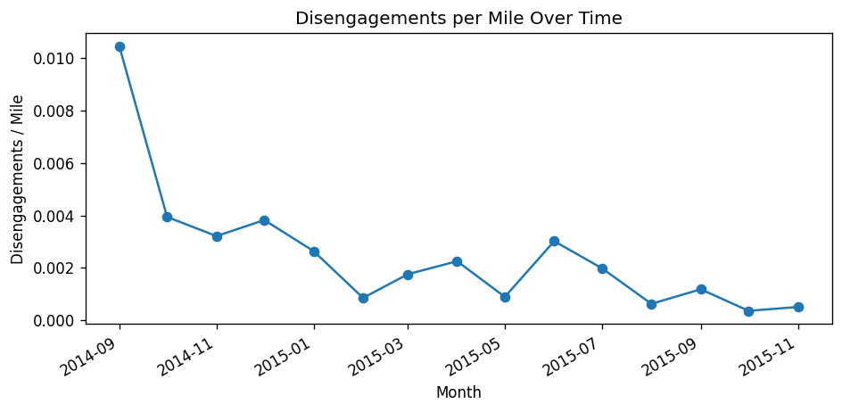
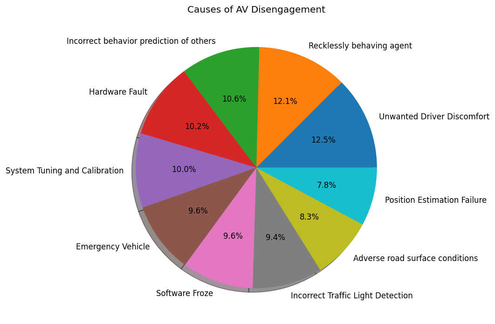
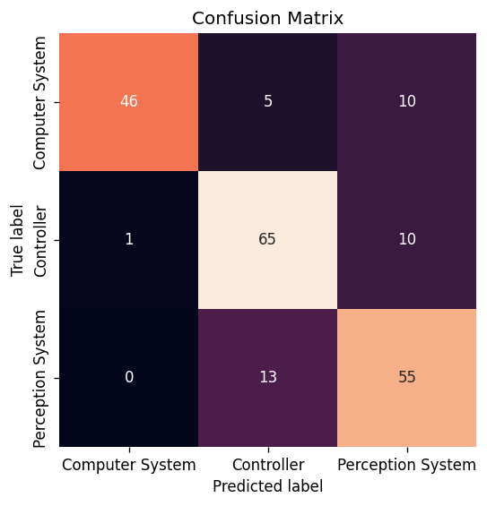

# Autonomous Vehicle Safety Analysis

Statistical analysis of California DMV autonomous vehicle (AV) disengagement
reports: descriptive statistics, probability/Bayesian analysis, hypothesis
testing, and a Naive Bayes classifier that predicts the *cause category* of a
disengagement from context (location, weather, trigger type).

A disengagement is logged whenever a failure in the AV system forces control
back to the human driver. California requires every manufacturer testing AVs
on public roads to report these events annually; this project analyzes that
public disengagement data to characterize AV safety and reliability.

## Key findings

- **1,024** disengagements recorded across **12** months, spanning **2** road
  types (highway, urban-street) and **10** distinct causes.
- The two leading causes are **Unwanted Driver Discomfort** and **Recklessly
  Behaving Agent** (~25% of events combined).
- Disengagements per mile driven **decline over time** (highest in Sep 2014,
  lowest by the end of the observation window) — consistent with AV systems
  maturing with more road testing.
- AV reaction time is significantly different from the human baseline
  (one-sample t-test, p ≈ 0.036 at α = 0.05).
- Disengagement rate is significantly higher on cloudy days than clear days
  (two-proportion z-test, p < 0.001) — P(disengagement/mile | cloudy) ≈ 0.0059
  vs. P(disengagement/mile | clear) ≈ 0.0005.
- A Gaussian Naive Bayes model predicts the disengagement's system-level cause
  (Controller / Perception System / Computer System) from location, weather,
  and trigger type with **~80% hold-out accuracy**.

| Disengagement rate over time | Leading causes | Classifier confusion matrix |
|---|---|---|
|  |  |  |

Full write-up with additional plots and discussion: [`reports/Final_Presentation.pdf`](reports/Final_Presentation.pdf).

## Data

| File | Description |
|---|---|
| `data/disengagements.csv` | One row per disengagement event: month, vehicle, location, weather, trigger type, reaction time, cause. |
| `data/total_miles.csv` | One row per vehicle-month: miles driven autonomously, and counts of total/automatic/manual disengagements. |

Source: [California DMV Autonomous Vehicle Disengagement Reports](https://www.dmv.ca.gov/portal/vehicle-industry-services/autonomous-vehicles/disengagement-reports/).

## Project structure

```
.
├── data/                     # Raw CSV data (from CA DMV disengagement reports)
├── src/avsa/                 # Installable analysis package
│   ├── data.py               # Loading & cleaning
│   ├── eda.py                # Descriptive statistics
│   ├── probability.py        # Conditional probability / Bayes' theorem
│   ├── hypothesis_tests.py   # t-test, z-test, KS test
│   ├── classifier.py         # Naive Bayes cause classifier
│   ├── visualize.py          # Plotting helpers
│   └── pipeline.py           # Runs the full analysis end-to-end
├── tests/                    # pytest unit tests for every module
├── notebooks/                # Original exploratory notebook (reference only)
├── figures/                  # Generated on demand by the pipeline (gitignored)
├── docs/images/              # Figures committed for the README
├── reports/                  # Final write-up (PDF)
└── .github/workflows/ci.yml  # Lint + test on every push/PR
```

## Setup

Requires Python 3.9+.

```bash
git clone https://github.com/anunaysharma/Autonomous-Vehicle-Safety-Analysis-.git
cd Autonomous-Vehicle-Safety-Analysis-
python -m venv .venv && source .venv/bin/activate
pip install -e ".[dev]"
```

## Usage

Run the full analysis pipeline (prints results, writes figures to `figures/`):

```bash
python -m avsa.pipeline
```

Or use the package directly:

```python
from avsa import data, eda, probability

df_diseng, df_miles = data.load_all()
summary = eda.summarize(df_diseng, df_miles)
print(summary)
```

The original exploratory notebook is preserved at
`notebooks/exploratory_analysis.ipynb` for reference; the `src/avsa` package
is the maintained, tested version of the same analysis.

## Testing

```bash
pytest --cov=avsa
```

16 unit tests cover data loading, descriptive statistics, probability
calculations, hypothesis tests, and the classifier. CI (`.github/workflows/ci.yml`)
runs `flake8`, `black --check`, and the test suite on Python 3.10 and 3.11 for
every push and pull request.

## Methodology notes

- **Probability model**: California's historical clear/cloudy day split
  (72%/28%) is used as the weather prior; conditional probabilities of
  disengagement given weather are derived via Bayes' theorem from the
  observed event log.
- **Classifier**: each disengagement cause is mapped to one of three system
  classes (Controller, Perception System, Computer System) based on the
  underlying failure mode, then a Gaussian Naive Bayes model is trained on
  label-encoded location/weather/trigger-type features.
- **Limitations**: the dataset is small (~1,000 events) and reaction time has
  ~52% missingness; results should be read as illustrative rather than
  definitive safety conclusions. See `reports/Final_Presentation.pdf` for a
  full discussion of assumptions and limitations.

## Contributors

Anunay Sharma, Aniruddha Sharma, Badrinarayanan R — originally developed for
CS 498: Data Science & Analytics.

## License

MIT — see [LICENSE](LICENSE).
